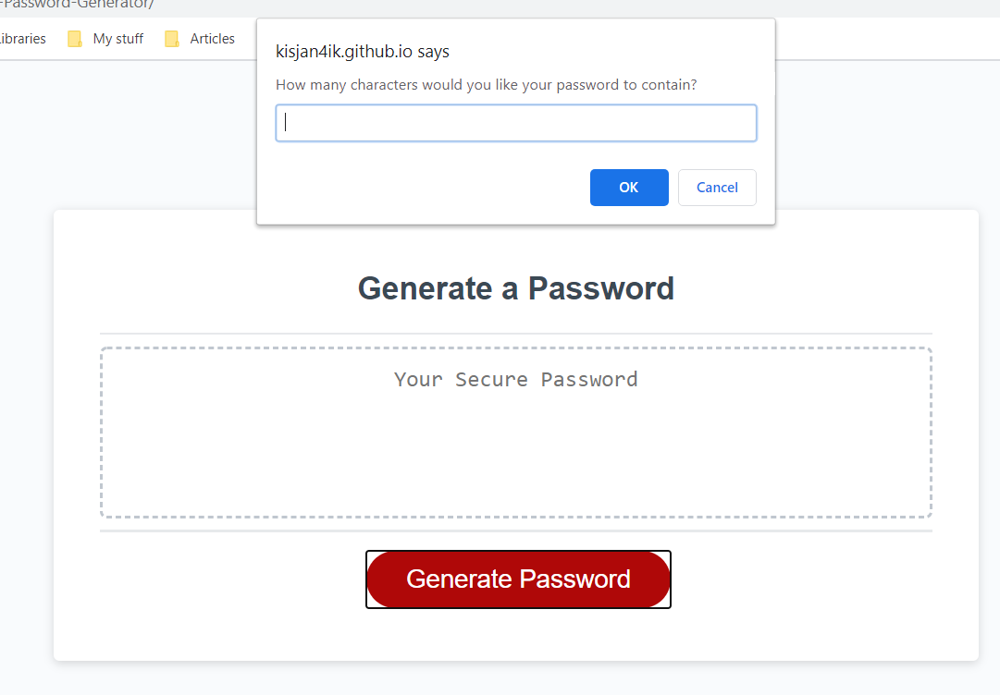
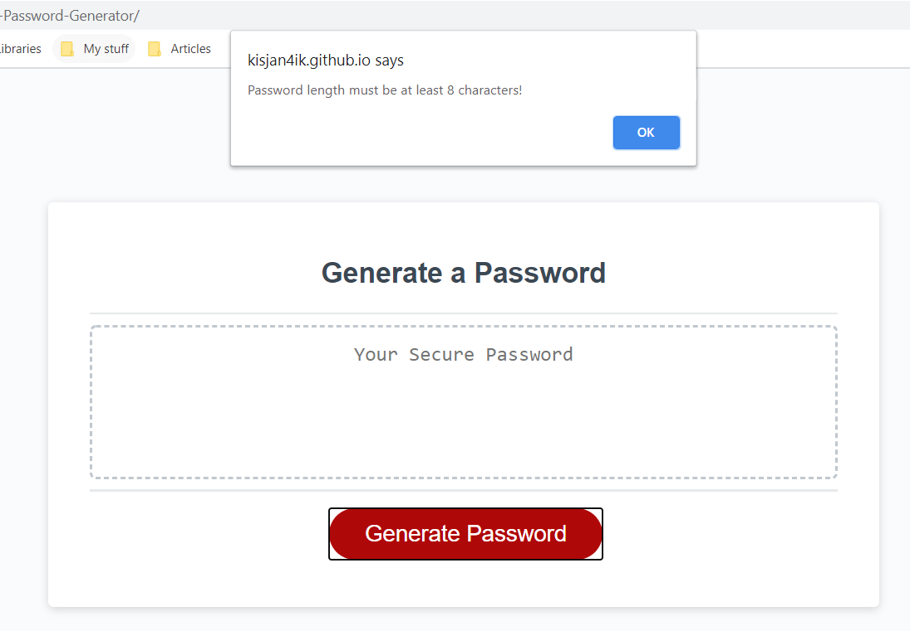
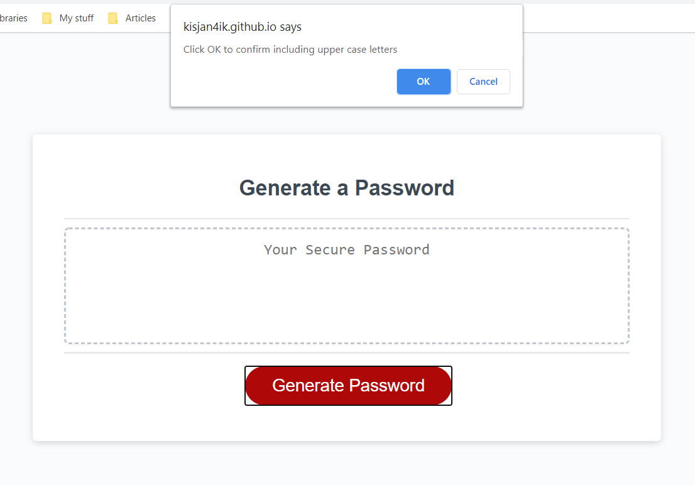

# JavaScript-Password-Generator

## Description 

The main task of this project is to create an application that generates a random password based on user-selected criteria. 
A user is presented with some questions to chose password length and  available symbols, such as: upper case letters, lower case letters, numbers and special symbols.
After the user chose all the parameters thd application generates random password.

For creating this application I utilize the following tools:

- variables
- functions
- strings
- arrays
- random
- comparisons
- conditions
- loops
- return statements
- booleans

## Usage 

This application can be used for generating passwods that contain from 8 to 128 symbols and allows to use any of upper case letters, lower case letters, numbers and special symbols. 

Here are the screenshots of the application:

# Setting criteria

# Generated password

Links to the repository on Github.com and to thesite published  at Github Host are the following:

 https://github.com/kisjan4ik/JavaScript-Password-Generator

 https://kisjan4ik.github.io/JavaScript-Password-Generator/

© Copyright 2020
